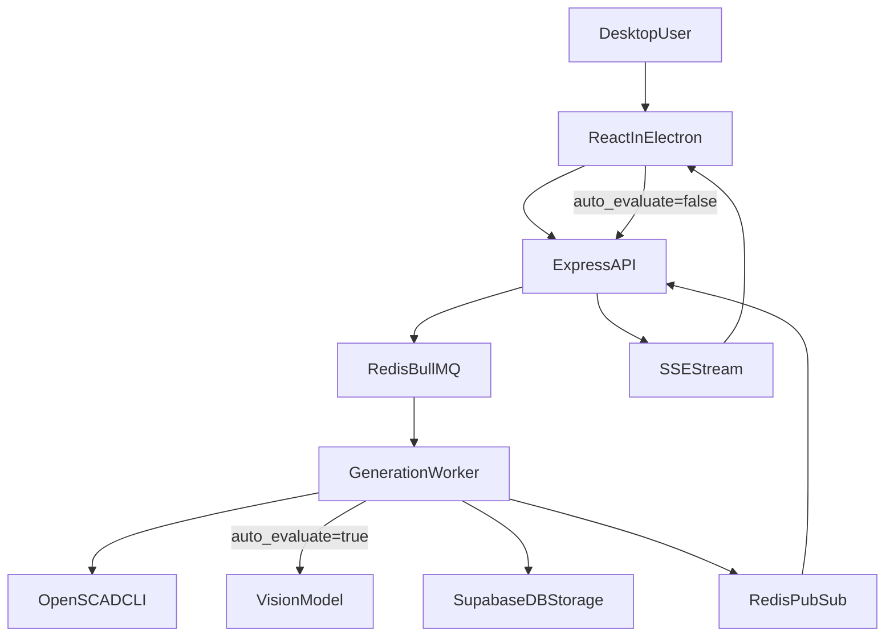

# MVP Plan: TypeScript + Express + Docker Compose

## Finalized Stack

- Desktop: Electron + React + TypeScript.
- Backend: Node.js + Express + TypeScript (no Python/FastAPI).
- Modeling: OpenSCAD CLI invoked from Node worker service.
- Image composition: Node image library (prefer `sharp`, fallback `jimp`) for 2x2 labeled grid.
- 3D viewer: React Three Fiber (or Three.js directly if needed).
- Realtime updates: Server-Sent Events (SSE).
- Auth/DB/Storage: Supabase (Google OAuth + email/password + Postgres + Storage).
- Orchestration: Docker Compose for MVP.

## Service-Oriented Folder Structure

- [app/](app/) - Electron shell and preload.
- [services/api/](services/api/) - Express API (auth-aware routes, history queries, SSE endpoint).
- [services/worker/](services/worker/) - Background generation pipeline (LLM/OpenSCAD/vision loop).
- [packages/shared/](packages/shared/) - shared TypeScript types for DTOs/events.
- [infra/docker/](infra/docker/) - Docker Compose files and service env templates.
- [infra/supabase/](infra/supabase/) - schema SQL, RLS policy SQL, bucket setup notes.

## Runtime Architecture

- `api` service handles:
  - `POST /api/generations` (create generation + enqueue task)
  - `GET /api/generations/:id/stream` (SSE)
  - `GET /api/generations` (list user's generations)
  - `GET /api/generations/:id` (generation detail with steps + assets)
  - `GET /api/projects` / `POST /api/projects` (project management)
  - `GET /api/presets` / `POST /api/presets` (user presets)
- `worker` service handles generation loop:
  1. LLM creates/revises OpenSCAD code.
  2. Write `step_n.scad` to temp workspace.
  3. Run OpenSCAD for STL + 4 angle renders.
  4. Combine renders into labeled 2x2 grid.
  5. Upload assets to Supabase Storage.
  6. If `auto_evaluate` is true: call vision model for score/feedback, then revise and loop.
  7. If `auto_evaluate` is false: persist step, emit progress, and stop. User reviews manually and can trigger further steps.
  8. Persist step and emit progress via Redis pub/sub.
  9. Repeat until score >= 8, max steps reached, or user stops.
- `api` and `worker` coordinate via Redis-backed queue (BullMQ).

## Compose Services (MVP)

- `desktop-dev` (optional local dev wrapper)
- `web` (React dev/build)
- `api` (Express)
- `worker` (Node TS worker)
- `redis` (queue + pub/sub for progress)
- Supabase stays managed cloud (no local supabase containers required for MVP)

## Data Model in Supabase

### `profiles`
Synced from `auth.users` via database trigger.

| Column | Type | Notes |
|---|---|---|
| id | uuid PK | FK to auth.users |
| email | text | |
| display_name | text | nullable |
| avatar_url | text | nullable |
| created_at | timestamptz | |
| updated_at | timestamptz | |

### `projects`
Optional folders to organize generations.

| Column | Type | Notes |
|---|---|---|
| id | uuid PK | |
| user_id | uuid FK | → profiles |
| name | text | |
| description | text | nullable |
| created_at | timestamptz | |
| updated_at | timestamptz | |

### `generations`
One row per prompt submission.

| Column | Type | Notes |
|---|---|---|
| id | uuid PK | |
| user_id | uuid FK | → profiles |
| project_id | uuid FK | nullable (ungrouped) |
| prompt | text | the user's natural language request |
| status | enum | queued, running, completed, failed, cancelled |
| model | text | which LLM was used |
| auto_evaluate | boolean | default true; when false, worker stops after each step for manual review |
| max_steps | int | default 5 |
| final_score | numeric | nullable, set on completion |
| error | text | nullable, set on failure |
| created_at | timestamptz | |
| completed_at | timestamptz | nullable |

### `steps`
Each LLM → compile → evaluate cycle within a generation.

| Column | Type | Notes |
|---|---|---|
| id | uuid PK | |
| generation_id | uuid FK | → generations |
| step_number | int | 1-indexed |
| status | enum | running, completed, failed |
| scad_code | text | the OpenSCAD source produced at this step |
| score | numeric | nullable, from vision model (null if auto_evaluate off) |
| feedback | jsonb | nullable, flexible vision model response |
| duration_ms | int | nullable |
| created_at | timestamptz | |
| completed_at | timestamptz | nullable |

### `assets`
Every file produced during generation.

| Column | Type | Notes |
|---|---|---|
| id | uuid PK | |
| generation_id | uuid FK | → generations |
| step_id | uuid FK | nullable (for final/merged assets) |
| kind | enum | scad, stl, render, grid, thumbnail |
| storage_path | text | path in Supabase Storage bucket |
| file_name | text | display name |
| mime_type | text | |
| size_bytes | bigint | nullable |
| metadata | jsonb | nullable (camera angle, dimensions, etc.) |
| created_at | timestamptz | |

### `presets`
Saved user configuration defaults.

| Column | Type | Notes |
|---|---|---|
| id | uuid PK | |
| user_id | uuid FK | → profiles |
| name | text | |
| config | jsonb | model prefs, max_steps, auto_evaluate default, style hints |
| is_default | boolean | default false |
| created_at | timestamptz | |
| updated_at | timestamptz | |

## Storage Policy

- Private bucket: `generation-assets`.
- Object paths:
  - `users/{user_id}/generations/{generation_id}/step_{n}/...`
  - `users/{user_id}/generations/{generation_id}/final/...`
- Worker uploads all important outputs (SCAD/STL/grid + optionally individual renders).
- API returns short-lived signed URLs for frontend display/download.

## SSE Event Contracts

- `step`: step number, stage, score (if evaluated), feedback, asset URLs.
- `status`: granular stage updates (`queued`, `generating_scad`, `compiling`, `rendering`, `evaluating`, `revising`, `awaiting_review`).
- `complete`: final asset URLs + final score.
- `error`: stage, message, retryable.

## Auto-Evaluate Behavior

When `auto_evaluate` is **true** (default):
- After each step's renders are produced, the vision model scores the output automatically.
- If score >= 8, generation completes. Otherwise the LLM revises using the feedback.
- Fully autonomous loop up to `max_steps`.

When `auto_evaluate` is **false**:
- After each step's renders are produced, the worker stops and emits `awaiting_review`.
- The user can inspect the renders/STL in the UI, provide manual feedback, and trigger the next step.
- Gives the user full control over the refinement process.

## Key Risks and Mitigations

- OpenSCAD process failures/timeouts in containers.
  - Mitigation: explicit timeouts, max 3 compile-retries, stderr-driven repair prompt.
- OAuth in Electron context.
  - Mitigation: browser-based OAuth + deep-link callback and secure token handoff.
- Queue/SSE synchronization complexity.
  - Mitigation: Redis pub/sub channel keyed by generation ID and idempotent status writes in DB.
- Asset storage growth.
  - Mitigation: retention policy for non-final assets (configurable per user/generation age).

## MVP Delivery Phases

1. Monorepo scaffolding (`apps`, `services`, `packages`, `infra`).
2. Supabase schema migration, RLS policies, storage bucket, shared TypeScript types.
3. Express API + auth middleware + Supabase integration.
4. Worker pipeline with OpenSCAD and image grid composition.
5. Redis queue + SSE streaming from generation progress.
6. Desktop UI screens: auth, prompt, live steps, final viewer/history.
7. Docker Compose wiring + dev scripts + env documentation.

## High-Level Flow

