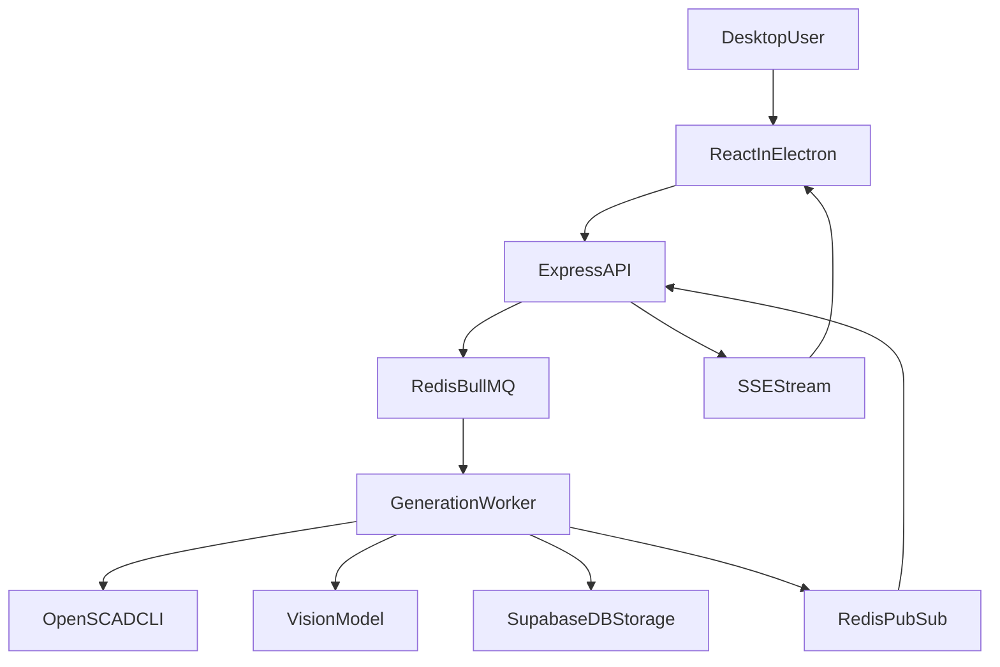

# Updated MVP Plan: TypeScript + Express + Docker Compose

## Finalized Stack

- Desktop: Electron + React + TypeScript.
- Backend: Node.js + Express + TypeScript (no Python/FastAPI).
- Modeling: OpenSCAD CLI invoked from Node worker service.
- Image composition: Node image library (prefer `sharp`, fallback `jimp`) for 2x2 labeled grid.
- 3D viewer: React Three Fiber (or Three.js directly if needed).
- Realtime updates: Server-Sent Events (SSE).
- Auth/DB/Storage: Supabase (Google OAuth + email/password + Postgres + Storage).
- Orchestration: Docker Compose for MVP.

## Service-Oriented Folder Structure

- [app/](app/) - Electron shell and preload.
- [services/api/](services/api/) - Express API (auth-aware routes, history queries, SSE endpoint).
- [services/worker/](services/worker/) - Background generation pipeline (LLM/OpenSCAD/vision loop).
- [packages/shared/](packages/shared/) - shared TypeScript types for DTOs/events.
- [infra/docker/](infra/docker/) - Docker Compose files and service env templates.
- [infra/supabase/](infra/supabase/) - schema SQL, RLS policy SQL, bucket setup notes.

## Runtime Architecture

- `api` service handles:
  - `POST /api/generate` (create job + enqueue task)
  - `GET /api/generate/:jobId/stream` (SSE)
  - history endpoints (`/api/jobs`, `/api/jobs/:jobId`)
- `worker` service handles generation loop:
  1. LLM creates/revises OpenSCAD code.
  2. Write `iter_n.scad` to temp workspace.
  3. Run OpenSCAD for STL + 4 views.
  4. Combine views into labeled grid.
  5. Upload artifacts to Supabase Storage.
  6. Call vision model for score/feedback.
  7. Persist iteration and emit progress.
  8. Repeat until score >= 8 or max 5 iterations.
- `api` and `worker` coordinate via Redis-backed queue (recommended: BullMQ).

## Compose Services (MVP)

- `desktop-dev` (optional local dev wrapper)
- `web` (React dev/build)
- `api` (Express)
- `worker` (Node TS worker)
- `redis` (queue + pub/sub for progress)
- Supabase stays managed cloud (no local supabase containers required for MVP)

## Data Model in Supabase

- `profiles` (id, email, created_at)
- `jobs` (id, user_id, prompt, status, final_score, created_at, completed_at, config_json)
- `iterations` (id, job_id, iter_num, score, correct_text, main_issue, suggested_fix, llm_context, created_at)
- `artifacts` (id, job_id, iteration_id nullable, kind, storage_path, mime_type, size_bytes, created_at)
- optional `job_events` for debugging/status timeline

## Storage Policy

- Private bucket: `job-artifacts-private`.
- Object paths:
  - `users/{user_id}/jobs/{job_id}/iter_{n}/...`
  - `users/{user_id}/jobs/{job_id}/final/...`
- Worker uploads all important outputs (SCAD/STL/grid + optionally view renders).
- API returns short-lived signed URLs for frontend display/download.

## SSE Event Contracts

- `iteration`: iteration number, stage, score, feedback, artifact URLs.
- `status`: granular stage updates (`queued`, `generating_scad`, `compiling`, `rendering`, `evaluating`, `revising`).
- `complete`: final artifact URLs + final score.
- `error`: stage, message, retryable.

## Key Risks and Mitigations

- OpenSCAD process failures/timeouts in containers.
  - Mitigation: explicit timeouts, max 3 compile-retries, stderr-driven repair prompt.
- OAuth in Electron context.
  - Mitigation: browser-based OAuth + deep-link callback and secure token handoff.
- Queue/SSE synchronization complexity.
  - Mitigation: Redis pub/sub channel keyed by job ID and idempotent status writes in DB.
- Artifact storage growth.
  - Mitigation: retention policy for non-final artifacts (configurable per user/job age).

## MVP Delivery Phases

1. Monorepo scaffolding (`apps`, `services`, `packages`, `infra`).
2. Express API + auth middleware + Supabase integration.
3. Worker pipeline with OpenSCAD and image grid composition.
4. Redis queue + SSE streaming from job progress.
5. Desktop UI screens: auth, prompt, live iteration, final viewer/history.
6. Docker Compose wiring + dev scripts + env documentation.

## High-Level Flow

## Additional Questions

No blocking questions remain for planning. When you want, I can start execution with Phase 1 by scaffolding the monorepo folders and initializing the Electron app under `apps/desktop` plus the React renderer under `apps/web`.
