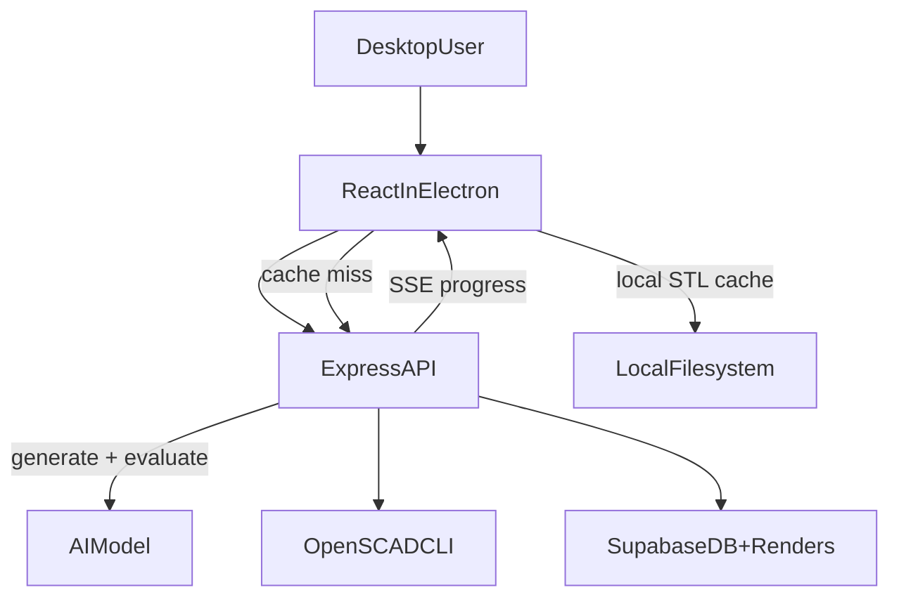

# MVP Plan: TypeScript + Express

## Finalized Stack

- Desktop: Electron + React + TypeScript.
- Backend: Node.js + Express + TypeScript. Single API service handles routes and generation.
- AI Model: Single model (e.g. GPT-4o) handles both SCAD code generation and vision-based evaluation.
- Modeling: OpenSCAD CLI invoked from the API service.
- Image composition: Node image library (prefer `sharp`, fallback `jimp`) for 2x2 labeled grid.
- 3D viewer: React Three Fiber (or Three.js directly if needed).
- Realtime updates: Server-Sent Events (SSE), streamed directly from the generation loop.
- Auth/DB/Storage: Supabase (Google OAuth + email/password + Postgres + Storage).

## Folder Structure

- [app/](app/) - Electron shell, preload, and React renderer.
- [services/api/](services/api/) - Express API (routes, auth, generation loop, SSE).
- [packages/shared/](packages/shared/) - shared TypeScript types for DTOs/events.
- [infra/docker/](infra/docker/) - Docker Compose file and env templates.
- [infra/supabase/](infra/supabase/) - schema SQL, RLS policy SQL, bucket setup.

## Runtime Architecture

Single API service handles everything. No separate worker, no message queue.

- **API routes:**
  - `POST /api/prompts` (create prompt + kick off generation)
  - `GET /api/prompts/:id/stream` (SSE — streams progress directly from the generation loop)
  - `POST /api/prompts/:id/cancel` (cancel a running generation)
  - `GET /api/prompts/:id/stl` (on-demand STL compilation from SCAD code in DB)
  - `GET /api/projects` / `POST /api/projects` (project CRUD)
  - `GET /api/projects/:id/prompts` (list prompts in a project)
  - `GET /api/users/me` / `PATCH /api/users/me` (profile + defaults)
- **Generation loop (runs inline in the API process):**
  1. AI model generates/revises OpenSCAD code.
  2. Write `.scad` to temp workspace.
  3. Run OpenSCAD to produce 4 angle renders.
  4. Combine renders into labeled 2x2 grid + downscale one as thumbnail.
  5. Upload grid/thumbnail to Supabase Storage (`renders` bucket).
  6. If `auto_evaluate` is true: send renders to AI model for score/feedback, revise and loop.
  7. If `auto_evaluate` is false: single pass, no vision loop.
  8. Stream progress to the SSE connection at each stage.
  9. On completion: write final `scad_code` + `score` to the `prompts` row in DB.
  10. Repeat internally until score >= 8, max steps reached, or cancelled.
- All generation work is async I/O (LLM API calls, child process spawns, file uploads) so it does not block the Node event loop. Multiple generations can run concurrently.
- Intermediate steps (SCAD revisions, per-step scores) are ephemeral — held in memory during the run, discarded after. Only the final result is persisted.

## Compose Services (MVP)

- `api` (Express — handles routes + generation)
- Supabase stays managed cloud (no local containers required for MVP)
- Electron app runs natively on the user's machine (not containerised)

## Data Model in Supabase

Three tables. Simple chain: users → projects → prompts.

### `users`
Synced from `auth.users` via database trigger. Stores user-level defaults.

| Column | Type | Notes |
|---|---|---|
| id | uuid PK | FK to auth.users |
| email | text | |
| display_name | text | nullable |
| avatar_url | text | nullable |
| defaults | jsonb | model, max_steps, auto_evaluate, style hints |
| created_at | timestamptz | |
| updated_at | timestamptz | |

### `projects`
Groups related prompts. Every prompt belongs to a project.

| Column | Type | Notes |
|---|---|---|
| id | uuid PK | |
| user_id | uuid FK | → users |
| name | text | |
| description | text | nullable |
| config | jsonb | project-level overrides: model, max_steps, auto_evaluate |
| created_at | timestamptz | |
| updated_at | timestamptz | |

### `prompts`
One row per user prompt. Stores only the final/best result.

| Column | Type | Notes |
|---|---|---|
| id | uuid PK | |
| project_id | uuid FK | → projects |
| user_id | uuid FK | → users (denormalised for RLS) |
| prompt | text | the user's natural language request |
| scad_code | text | nullable, final OpenSCAD code (null while generating) |
| status | enum | queued, running, completed, failed, cancelled |
| score | numeric | nullable, final vision score |
| error | text | nullable, set on failure |
| model | text | which AI model was used |
| auto_evaluate | boolean | default true |
| max_steps | int | default 5 |
| created_at | timestamptz | |
| completed_at | timestamptz | nullable |

## Storage

### Cloud (Supabase Storage)
- Private bucket: `renders`.
- Convention-based paths (no assets table):
  - `users/{user_id}/prompts/{prompt_id}/grid.png`
  - `users/{user_id}/prompts/{prompt_id}/thumbnail.png`
  - `users/{user_id}/prompts/{prompt_id}/render_{angle}.png` (optional individual views)
- API uploads grid + thumbnail on generation completion.
- API returns short-lived signed URLs for the frontend.

### Local (Electron app filesystem)
- STL files are cached on the user's local machine after first compile.
- Path convention: `{app_data}/cache/stl/{prompt_id}.stl`
- If the local file is missing (cache cleared, new machine), the Electron app requests on-demand STL compilation from the backend via `GET /api/prompts/:id/stl`.
- The backend compiles from `prompts.scad_code` in the DB — the SCAD code is always the source of truth.

## SSE Event Contracts

- `status`: current stage + internal step number (`queued`, `generating_scad`, `compiling`, `rendering`, `compositing`, `evaluating`, `revising`).
- `complete`: final SCAD code + score.
- `error`: message, retryable flag.
- `cancelled`: emitted when a generation is cancelled mid-run.

Note: intermediate step details (per-step scores, feedback) are not exposed to the client. The user only sees the current stage and the final result.

## Auto-Evaluate Behavior

When `auto_evaluate` is **true** (default):
- The API runs the full vision loop internally: generate → render → evaluate → revise.
- Repeats until score >= 8 or max steps reached.
- The user sees progress stages via SSE and gets the final best result.

When `auto_evaluate` is **false**:
- Single pass: generate → render → done. No vision evaluation loop.
- The user gets the result immediately and can submit a follow-up prompt to refine ("make it taller", "add chamfers").

## Key Risks and Mitigations

- OpenSCAD process failures/timeouts.
  - Mitigation: explicit timeouts, max 3 compile-retries, stderr-driven repair prompt.
- OAuth in Electron context.
  - Mitigation: browser-based OAuth + deep-link callback and secure token handoff.
- Long-running generation blocking the API.
  - Mitigation: all steps are async I/O (HTTP calls, child processes, file ops). Node event loop stays free.
- Local STL cache invalidation.
  - Mitigation: cache keyed by prompt ID; SCAD code is immutable after completion.

## MVP Delivery Phases

1. Monorepo scaffolding (`app`, `services/api`, `packages/shared`, `infra`).
2. Supabase schema migration, RLS policies, storage bucket, shared TypeScript types.
3. Express API: auth middleware, CRUD routes, generation loop, SSE streaming.
4. Desktop UI screens: auth, prompt, live progress, STL viewer with local cache, project history.
5. Docker Compose for API + dev scripts + env documentation.

## High-Level Flow

